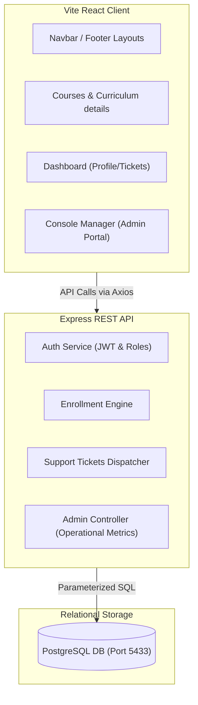

# Ascope Tech — Advanced Training System Integration

Welcome to the **Ascope Tech** full-stack technical training and operations platform. This codebase has been audited, structured, and upgraded into a production-grade educational architecture utilizing React (TypeScript) on the frontend, Node.js + Express on the backend, and a robust PostgreSQL relational database layer.

---

## 🏗️ System Architecture Overview



---

## 🛠️ Technology Stack & Isolation

- **Frontend**: React.js 19 + TypeScript + Vite + Framer Motion (premium micro-animations) + Tailwind CSS (tailored navy, cream, white, and gold visual aesthetics).
- **Backend**: Node.js + Express.js secured via **Helmet** and **Express Rate Limiting** configurations.
- **Database Layer**: PostgreSQL running on port **`5433`** with localized database pools.
- **Bootloader Migrations**: Automated DDL migration checks are executed on server startup, verifying the presence of `courses`, `contacts`, `enrollments`, `users`, `tickets`, and `user_settings`.

---

## 🔐 Security & Access Authorization

1. **Helmet Middleware**: Configures HTTP headers to protect against web vulnerabilities.
2. **Rate Limiters**: Restricts API calls to a maximum of 150 requests per 15-minute window per IP.
3. **Role Validation (JWT)**: Secure route protection ensures only logged-in administrators with authenticated credentials (`role === 'admin'`) can query analytic aggregates, approve student applications, or resolve support tickets.

---

## 📡 API Endpoint Reference

### Authentication Routing (`/api/auth`)
- `POST /api/auth/register` — Registers a student account (defaults to `student` role).
- `POST /api/auth/login` — Generates a signed JSON Web Token (JWT).
- `GET /api/auth/profile` — Retrieves the authenticated user's profile card (JWT required).
- `PUT /api/auth/profile` — Modifies registration contacts (JWT required).

### Course Catalog & Enrollments (`/api/courses`, `/api/enroll`)
- `GET /api/courses` — Lists all catalog courses (joins fallback mock data if DB empty).
- `POST /api/courses` — Publishes a new course to the database catalog (Admin only).
- `POST /api/enroll` — Submits a student enrollment form in `pending` status.

### Support Case Center (`/api/tickets`)
- `POST /api/tickets` — Raises a new student support ticket (JWT required).
- `GET /api/tickets` — Lists all tickets raised by the current authenticated student (JWT required).

### Administrative Systems (`/api/admin`)
- `GET /api/admin/analytics` — Gathers realtime aggregate counts (Users, Course registrations, Open/Resolved tickets) (Admin only).
- `GET /api/admin/users` — Directory of all registered user accounts (Admin only).
- `GET /api/admin/enrollments` — Master directory of all student applications (Admin only).
- `PUT /api/admin/enrollments/:id` — Approves (`approved`) or declines (`rejected`) an enrollment application (Admin only).
- `GET /api/admin/tickets` — Lists all open/resolved system tickets (Admin only).
- `PUT /api/admin/tickets/:id` — Marks support cases as `resolved` (Admin only).

---

## 🚀 Step-by-Step Launch Guide

### 1. Pre-requisites & Database Boot
Ensure your PostgreSQL instance is running on port **`5433`** and the `ascope_db` database is created.
```bash
# Verify connection (optional)
node backend/test_db.js
```

### 2. Launch the Express API Server
Installing dependencies and booting the backend will automatically migrate the database tables and seed the default administrator user (`admin@ascopetech.com` / `adminpassword`).
```bash
cd backend
npm install
npm run start
```

### 3. Launch the Vite React Client
Install assets and launch the development server.
```bash
cd frontend
npm install
npm run dev
```

---

## 🏆 Programmatic Integration Audits

To audit the complete platform loop, we have implemented an automated E2E testing framework. It simulates a student registering, logging in, requesting enrollment, raising a support ticket, followed by an administrator authenticating, generating analytics, approving the enrollment, and resolving the ticket.

Execute the integration test with:
```bash
cd backend
node test_integration.js
```

Successful runs will conclude with:
```text
🎉 ========================================================
🏆 E2E AUDIT RESULTS: ALL 10 STEPS COMPLETED 100% SUCCESSFULLY!
🎉 ========================================================
```
